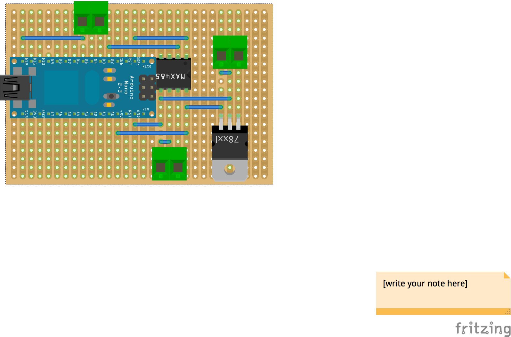
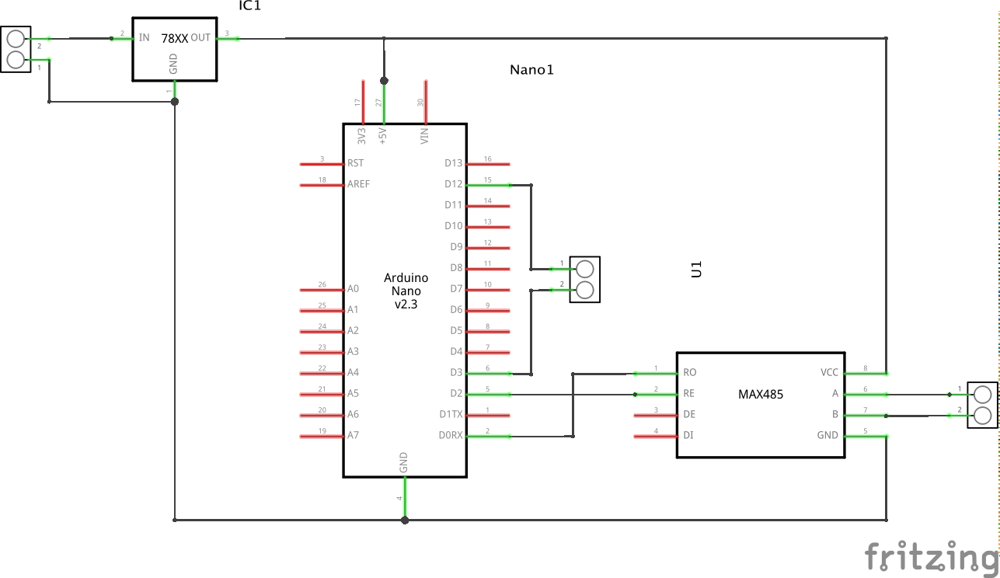

# depth-repeater

Code to read output from chartplotter (NMEA DPT sentence)

[Arduino code](https://github.com/ianhandel/depth-repeater/blob/master/NASAMarine_i2c_to_daughter_display_serial_in/NASAMarine_i2c_to_daughter_display_serial_in.ino)

Then parse out depth

Convert to 7 segments etc 

Then write out to NASA Depth Repeater

I2C bit banging and 7 segment code from modified from Peter Holtermann

See... http://wiki.openseamap.org/wiki/De:NASA_Clipper_Range

